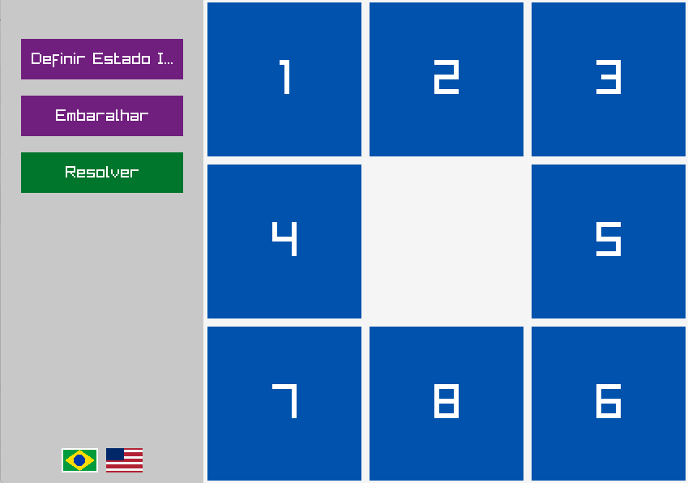
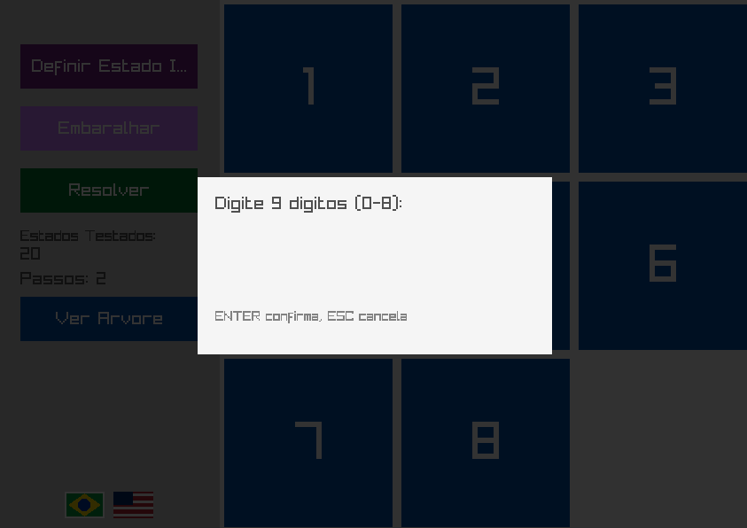
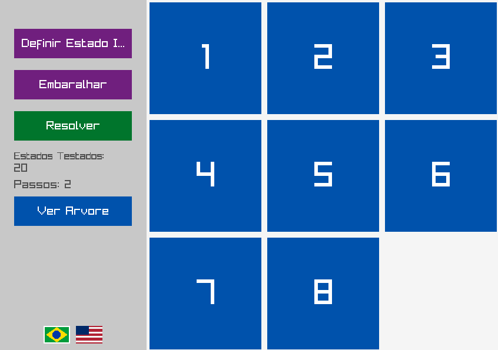
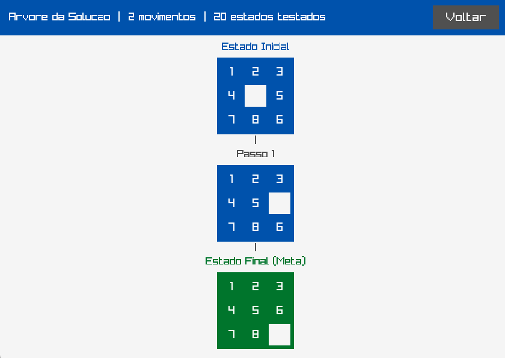

# Implementação do Algoritmo de Busca em Largura para o Problema do 8 Puzzle

Este repositório contém o código-fonte e a documentação referentes ao trabalho prático de implementação do algoritmo de Busca em Largura (Breadth-First Search - BFS) aplicado à resolução do problema do 8-Puzzle para a disciplina de Inteligência Artificial, ministrada pelo professor Andrws Vieira, do Instituto Federal de Ciência, Tecnologia e Educação do Rio Grande do Sul - Campus Ibirubá.

O problema do 8-Puzzle consiste em um quebra-cabeça deslizante, composto por uma grade 3x3 contendo 8 peças numeradas (de 1 a 8) e um espaço vazio, representado pelo dígito 0. O objetivo do algoritmo é calcular a sequência ótima de movimentos para transitar de um estado inicial arbitrário até o estado final (meta), minimizando o número de transições.

## 1. Disponibilidade e Execução

Para fins de avaliação e validação, uma versão compilada do software foi disponibilizada. 

* **Arquivo Executável:** [8_puzzle_solver.exe (v1.0.1)](https://github.com/RuanVasco/8-puzzle-solver/releases/tag/1.0.1)

A execução deste arquivo em ambiente Windows dispensa a necessidade de configuração prévia de compiladores ou bibliotecas.

## 2. Instruções de Compilação (Código-Fonte)

O projeto foi desenvolvido na linguagem C++ e faz uso da biblioteca gráfica `raylib` para a renderização da interface e visualização das soluções. 

**Pré-requisitos:**
* Compilador com suporte ao padrão C++11 ou superior (GCC/MinGW, Clang ou MSVC).
* Biblioteca [raylib](https://www.raylib.com/) devidamente instalada e vinculada ao *path* do compilador.

*(Nota: Insira aqui os comandos exatos de compilação utilizados no seu ambiente, como por exemplo: `g++ -o solver main.cpp ui/*.cpp models/*.cpp -lraylib -lGL -lm -lpthread -ldl -lrt -lX11`)*

## 3. Especificação de Entrada e Saída

O software foi projetado para receber o estado inicial e fornecer os resultados de forma interativa e visual, cumprindo os requisitos de formatação exigidos.

### 3.1. Entrada de Dados
A inserção do estado inicial é realizada via interface gráfica:
1. Acione a função "Definir Estado Inicial" (Set Initial State).
2. Insira uma sequência linear de 9 dígitos únicos, compreendidos entre 0 e 8, onde 0 denota o espaço vazio.
3. Alternativamente, é suportada a inserção via área de transferência (`Ctrl+V`). Exemplo de entrada válida: `123456708`.
4. Pressione `ENTER` para confirmar a configuração do tabuleiro.

### 3.2. Saída de Dados e Visualização
Após o acionamento da função "Resolver", o sistema apresenta:
* **Animação da Solução:** Transição gráfica passo a passo do tabuleiro, desde o estado inicial até a meta.
* **Métricas de Desempenho:** Exibição do número total de movimentos requeridos (passos) e do número absoluto de estados testados (nós expandidos na árvore de busca).
* **Árvore da Solução (Visualização Gráfica):** Uma interface dedicada que mapeia visualmente a sequência completa de estados (caminho ótimo) gerada pelo algoritmo, atendendo ao critério de diferencial qualitativo.

### 3.3. Exemplos de Execução

Abaixo estão exemplos do software em funcionamento:

* **Tela Inicial e Inserção de Dados:**
  
  

* **Processamento e Animação da Solução:**
  

* **Árvore da Solução (Visualização do Caminho):**
  

## 4. Metodologia de Implementação (Busca em Largura)

A busca em largura (BFS) foi implementada de forma a garantir a completude e a otimalidade da solução. A arquitetura do solucionador (`Solver`) emprega as seguintes estruturas de dados da Standard Template Library (STL) do C++:

* **`std::queue<PuzzleBoard>` (Fila de Fronteira):** Gerencia os nós a serem expandidos. A propriedade FIFO (First-In, First-Out) da fila assegura que a exploração do espaço de estados ocorra estritamente nível por nível, garantindo a localização do caminho mais curto.
* **`std::set<std::vector<int>>` (Conjunto de Explorados):** Armazena as configurações de tabuleiro já visitadas. Esta estrutura possui complexidade de busca logarítmica, prevenindo ciclos infinitos e reduzindo drasticamente o tempo de execução ao podar estados redundantes.
* **`std::map<std::vector<int>, PuzzleBoard>` (Mapeamento de Ancestralidade):** Associa cada estado gerado ao seu respectivo nó pai. Uma vez alcançado o estado meta, este mapa é percorrido em ordem reversa (*backtracking*) para reconstruir o caminho exato de movimentos.
* **Processamento Assíncrono (`std::async` / `std::future`):** O processamento do algoritmo ocorre em uma *thread* separada. Isso impede o bloqueio da *main thread* responsável pela renderização da interface gráfica (raylib), mantendo a aplicação responsiva mesmo durante a avaliação de milhares de estados combinatórios.

## 5. Recursos Adicionais

* **Geração Estocástica (Shuffle):** Permite a criação de estados iniciais pseudoaleatórios válidos através da aplicação de transições randômicas a partir da meta.
* **Suporte Bilíngue:** A interface suporta alternância em tempo real entre os idiomas Português (PT) e Inglês (EN).

---
**Desenvolvido por:** Ruan Vasconcelos e Caetano Matos